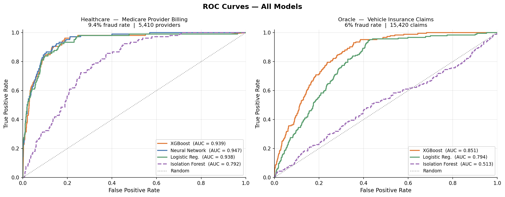
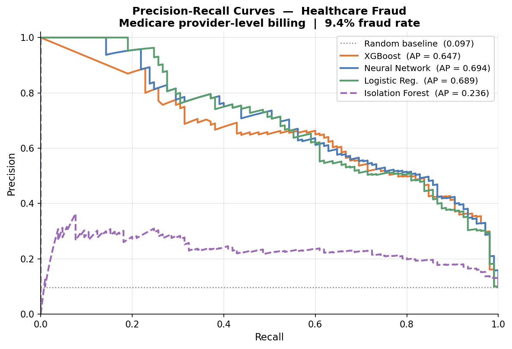
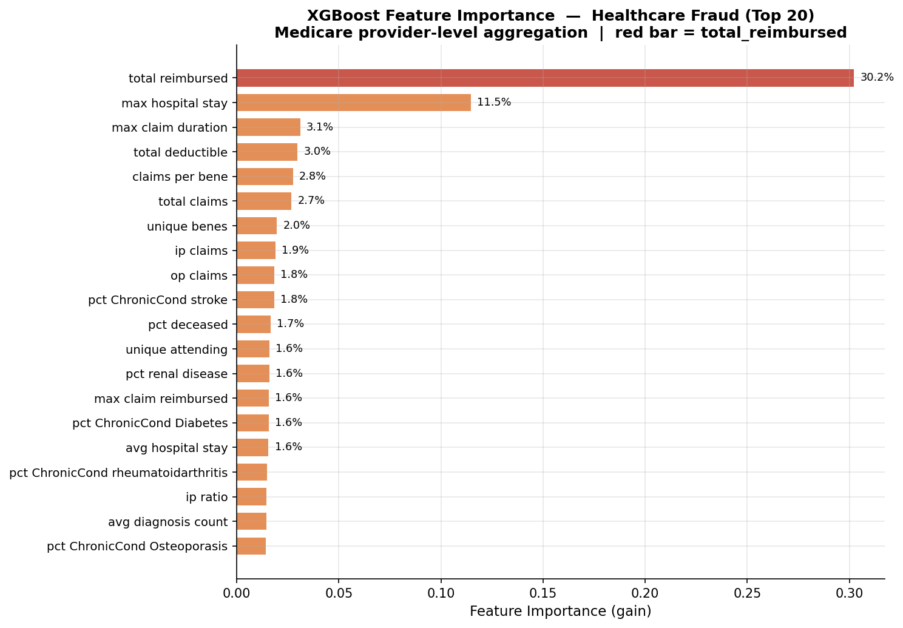
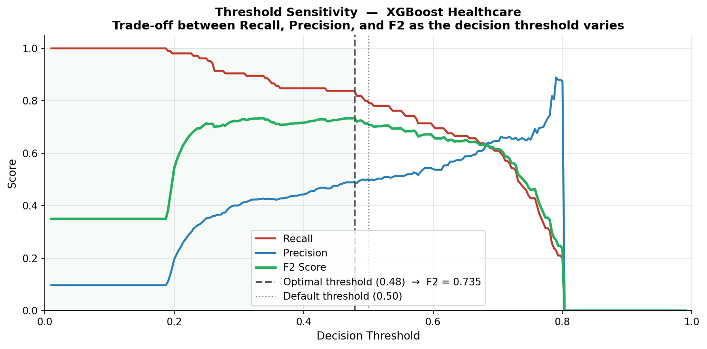

# Fraud Detection using Machine Learning

A machine learning project comparing supervised and unsupervised fraud detection across two datasets: automobile insurance claims (Fraud Oracle) and Medicare provider billing (Healthcare Fraud). Models include Logistic Regression, Neural Network, XGBoost, and Isolation Forest.

---

## Project Structure

```
ML-Project/
├── dataset/
│   ├── fraud_oracle_preprocessed.csv                # Preprocessed Oracle dataset
│   └── healthcare_fraud_preprocessed.csv            # Aggregated provider-level dataset
├── models/
│   ├── LogisticRegression.py                        # Healthcare — Logistic Regression
│   ├── NeuralNetworks.py                            # Healthcare — Neural Network (k-fold tuned)
│   ├── XGBoost.py                                   # Healthcare — XGBoost (k-fold tuned)
│   └── IsolationForest.py                           # Healthcare — Isolation Forest (unsupervised)
├── utils/
│   ├── preprocess_fraud_oracle.py                   # Oracle feature engineering
│   ├── preprocess_healthcare_fraud.py               # Healthcare join + aggregation pipeline
│   └── visualize.py                                 # Generate report figures → figures/
├── fraud_oracle_results.txt                         # Full Oracle results for all models
├── healthcare_results.txt                           # Full Healthcare results for all models
├── requirements.txt
└── README.md
```

---

## Datasets

### 1. Fraud Oracle — Vehicle Insurance Claims

**Source:** [Vehicle Insurance Fraud Detection — Figshare](https://figshare.com/articles/dataset/fraud_oracle_csv/24994233?file=44033394)
**Rows:** 15,420 insurance claims | **Target:** `FraudFound_P` (binary)
**Fraud rate:** ~6% (highly imbalanced)

**Data split:** 80/10/20 stratified — 11,102 train / 1,234 validation / 3,084 test (185 fraud in test)

**Preprocessing** (`utils/preprocess_fraud_oracle.py`):
- Ordinal string ranges (age, price, vehicle age) mapped to numeric midpoints
- Cyclical sin/cos encoding for month and day-of-week features to preserve periodicity
- Derived features: `Driver_Vehicle_Age_Diff`, `PolicyHolder_Driver_Age_Diff`, `Days_Accident_to_Claim`, `Claim_Before_Accident`, `Has_Past_Claims`, `New_Vehicle`, `Young_Driver`, `High_Value_Vehicle`
- Cyclical weekend indicators: `Accident_Weekend`, `Claim_Weekend`
- Binary encoding for `PoliceReportFiled`, `WitnessPresent`
- Rep-level claim count (`Rep_Claim_Count`) as a network frequency feature
- Redundant binary flags removed (duplicates of categorical columns)
- Final feature set: 34 numerical + 9 categorical features

### 2. Healthcare Fraud — Medicare Provider Billing

**Source:** [Healthcare Provider Fraud Detection — Kaggle](https://www.kaggle.com/datasets/rohitrox/healthcare-provider-fraud-detection-analysis?resource=download)
**Structure:** 4 relational CSV files joined by foreign keys

| File | Rows | Description |
|------|-----:|-------------|
| Train labels | 5,410 | Provider ID + `PotentialFraud` (Yes/No) |
| Beneficiary data | 138,556 | Patient demographics, chronic conditions |
| Inpatient claims | 40,474 | Hospital admissions with diagnosis/procedure codes |
| Outpatient claims | 517,737 | Outpatient visits with diagnosis codes |

**Fraud rate:** ~9.4% | **Target:** Provider-level fraud (one row per provider)

**Data split (supervised models):** 80/20 stratified — 4,328 train+val / 1,082 test (101 fraud in test); within train+val, 5-fold CV is used for hyperparameter tuning, then a 90/10 split for final training/early-stopping.

**Preprocessing** (`utils/preprocess_healthcare_fraud.py`):

The multi-file structure is handled as a relational join pipeline:
1. **Beneficiary engineering** — compute patient age from DOB (reference date 2009-12-31), recode chronic conditions (1/2 → 1/0), flag deceased patients, compute `Chronic_Count`, recode `RenalDiseaseIndicator` (Y/0 → 1/0)
2. **Claim-level engineering** — compute `ClaimDuration`, `HospitalStay` (inpatient only), `DiagnosisCount`, `ProcedureCount`, `SamePhysician` (attending == operating, a self-referral flag)
3. **JOIN** — attach beneficiary demographics to each claim via `BeneID` (left join)
4. **GROUP BY Provider** — aggregate 558,211 combined claims into one row per provider with ~40 features

Key aggregated features include:
- **Volume:** `total_claims`, `ip_claims`, `op_claims`, `ip_ratio`, `claims_per_bene`, `unique_benes`
- **Billing:** `total_reimbursed`, `avg_claim_reimbursed`, `max_claim_reimbursed`, `total_deductible`, `reimbursed_per_bene`
- **Temporal:** `avg_claim_duration`, `max_claim_duration`, `avg_hospital_stay`, `max_hospital_stay`
- **Network:** `unique_attending`, `unique_operating`, `pct_same_physician`, `physicians_per_bene`, `avg_diagnosis_count`, `avg_procedure_count`
- **Patient profile:** `avg_bene_age`, `pct_deceased`, `avg_chronic_count`, `pct_renal_disease`, `avg_ip_annual_reimb`, `avg_op_annual_reimb`, `avg_months_partA`, `avg_months_partB`, per-condition prevalence rates (12 chronic condition columns)

---

## Models

### Supervised (Healthcare)

| Model | Architecture / Key Details |
|-------|---------------------------|
| **Logistic Regression** | PyTorch `nn.Linear(n_features, 1)`, weighted BCE loss (`pos_weight = n_neg/n_pos`), Adam lr=0.001, early stopping on val ROC-AUC (patience=50), threshold optimised for F2 on validation set |
| **Neural Network** | Variable hidden layers + BatchNorm + ReLU + Dropout, weighted BCE, Adam with weight decay, early stopping on val F2 (patience=30/50), architecture and hyperparameters selected by 5-fold CV maximising F2 |
| **XGBoost** | `binary:logistic`, `scale_pos_weight = n_neg/n_pos`, `tree_method=hist`, early stopping on val AUC (30 rounds during CV, 50 rounds for final model), threshold optimised for F2 on validation set; hyperparameters selected by 5-fold CV maximising F2 |

### Unsupervised (Healthcare)

| Model | Key Details |
|-------|-------------|
| **Isolation Forest** | Trained on full training set (fraud and non-fraud), `n_estimators=200`, `contamination=0.35` (high value chosen to maximise recall — flags ~35% of samples as anomalous), anomaly score = `-score_samples()` for ROC AUC evaluation |

> **Note on the Autoencoder:** An Autoencoder (PyTorch encoder-decoder trained on non-fraud only, evaluated via reconstruction error) was explored as an additional unsupervised baseline on the Fraud Oracle dataset. It achieved ROC AUC 0.560 on Oracle, marginally above Isolation Forest (0.507). Neither method detected meaningful anomaly structure in the flat, per-claim Oracle rows. Both models underperformed significantly on that dataset and the Autoencoder was not carried forward to the Healthcare pipeline. Results are documented in `fraud_oracle_results.txt`.

### Best Hyperparameters Found (Healthcare)

**Neural Network** (selected by 5-fold CV, metric: mean F2):

| Hyperparameter | Best Value |
|----------------|-----------|
| Hidden sizes | (64, 32, 16) |
| Dropout | 0.2 |
| Learning rate | 0.001 |
| Weight decay | 1e-4 |
| Best CV mean F2 | 0.7509 |

**XGBoost** (selected by 5-fold CV over 72 combinations, metric: mean F2):

| Hyperparameter | Best Value |
|----------------|-----------|
| max_depth | 6 |
| learning_rate | 0.05 |
| subsample | 0.9 |
| min_child_weight | 3 |
| reg_lambda | 3.0 |
| n_estimators | 1000 (early stopped at 33) |
| Best CV mean F2 | 0.7670 |

### Training Protocol

- **Split:** 80% train+val / 20% test (stratified), held-out test never touched during tuning
- **Scaling:** `StandardScaler` fit on training fold only, applied to val/test — prevents leakage
- **Class imbalance:** `pos_weight = n_neg / n_pos` in BCE loss; `scale_pos_weight` in XGBoost
- **Thresholds:** Single decision threshold selected by maximising F2 on the validation set. F2 weights recall twice as heavily as precision (`β=2`), appropriate for fraud detection where missing a fraudster is more costly than a false alarm. Threshold search over 50 values in [0.05, 0.95].
- **Tuning metric:** F2 (Healthcare); F1 was used in earlier Oracle experiments before the project focus shifted

---

## Results



> ROC curves generated on a shared test split (random_state=42). Supervised model AUCs are slightly lower than the table values below because `visualize.py` uses an unstratified split to match the original Isolation Forest evaluation. Relative ordering and the supervised vs unsupervised gap are preserved.

### Fraud Oracle Dataset

Models were evaluated on the held-out test set of 3,084 claims (185 fraud, ~6%). Thresholds were chosen to maximise F1 (Oracle experiments). XGBoost results are shown for the recall-priority threshold (target recall ≥ 0.91) as it best captures fraud in a high-class-imbalance setting.

| Model | ROC AUC | Recall | Precision | F1 | F2 |
|-------|:-------:|:------:|:---------:|:--:|:--:|
| Logistic Regression | 0.783 | 0.935 | 0.120 | 0.212 | 0.391 |
| Neural Network | 0.810 | 0.481 | 0.192 | 0.274 | 0.373 |
| XGBoost (recall-priority) | **0.848** | **0.946** | 0.137 | 0.240 | 0.434 |
| XGBoost (max-F1 threshold) | **0.848** | 0.400 | 0.220 | **0.284** | 0.344 |
| Isolation Forest (unsupervised) | 0.507 | 0.568 | 0.068 | 0.121 | 0.230 |
| Autoencoder (unsupervised) | 0.560 | 0.481 | 0.071 | 0.124 | 0.223 |

**Oracle confusion matrices (test set: 2,899 non-fraud / 185 fraud):**

| Model | TN | FP | FN | TP |
|-------|---:|---:|---:|---:|
| Logistic Regression | 1,625 | 1,274 | 12 | 173 |
| Neural Network | 2,524 | 375 | 96 | 89 |
| XGBoost (recall-priority) | 1,798 | 1,101 | 10 | 175 |
| XGBoost (max-F1) | 2,636 | 263 | 111 | 74 |
| Isolation Forest | 1,457 | 1,442 | 80 | 105 |

---

### Healthcare Fraud Dataset

Models evaluated on the held-out test set of 1,082 providers (101 fraud, ~9.4%). Thresholds chosen to maximise F2.

| Model | ROC AUC | Recall | Precision | F1 | F2 | Threshold |
|-------|:-------:|:------:|:---------:|:--:|:--:|:---------:|
| Logistic Regression | 0.9618 | 0.8515 | 0.5513 | 0.6693 | 0.7679 | 0.7112 |
| Neural Network | 0.9636 | 0.8416 | 0.5862 | **0.6911** | 0.7741 | 0.7663 |
| XGBoost | **0.9703** | **0.9406** | 0.5108 | 0.6620 | **0.8051** | 0.1418 |
| Isolation Forest (unsupervised) | 0.7918 | 0.7714 | 0.2104 | 0.3306 | 0.5031 | — |

**Healthcare confusion matrices (test set: 981 non-fraud / 101 fraud):**

| Model | TN | FP | FN | TP |
|-------|---:|---:|---:|---:|
| Logistic Regression | 911 | 70 | 15 | 86 |
| Neural Network | 921 | 60 | 16 | 85 |
| XGBoost | 890 | 91 | 6 | 95 |
| Isolation Forest | 673 | 304 | 24 | 81 |



---

### Key Findings

1. **Provider-level aggregation unlocks signals that claim-level data cannot.** The healthcare dataset groups 558k claims into 5,410 provider rows, exposing billing patterns (volume, reimbursement rates, self-referral frequency) that are invisible at the individual claim level. Combined with temporal features (claim duration, hospital stay) and network features (unique physicians, patients per provider), this gives models a fundamentally richer picture of fraud than Oracle's flat, unlinked claim rows — and is the primary reason healthcare models achieve ROC AUC ~0.97 vs ~0.85 on Oracle.

2. **Fraud Oracle hit a structural ceiling.** All supervised models clustered between 0.78–0.85 ROC AUC regardless of architecture or tuning. The dataset has no linking IDs across claims, so it is impossible to aggregate a claimant's billing history or build temporal/network features — every claim is evaluated in isolation with no context about past behaviour.

3. **XGBoost consistently outperforms neural networks on tabular data.** Tree models are optimised for axis-aligned feature splits, which is how fraud manifests in structured records. The NN performance gap was smaller on the healthcare dataset (0.007 ROC AUC gap) than on Oracle (0.038 gap), as richer provider-level features reduce the NN's relative disadvantage by giving it more discriminative signal.

4. **Unsupervised methods reflect the data's anomaly structure.** On Oracle, Isolation Forest ROC AUC was 0.507 (effectively random) — fraud cases are not statistical outliers in a flat per-claim row. On Healthcare it achieved 0.792 — fraudulent providers genuinely bill anomalously when their full claim history is aggregated. The unsupervised performance gap directly measures how "detectable without labels" the fraud is in each dataset's feature space.

5. **Feature engineering from relational joins is the highest-leverage action.** `total_reimbursed` alone accounted for ~30.8% of XGBoost feature importance on the healthcare dataset. This feature required joining 4 CSV files and aggregating 558k claims — it cannot be derived from a flat single-table dataset. No amount of modelling sophistication compensates for missing this aggregation step.



6. **Class weights matter less when fraud is easier to separate.** On Healthcare (9.4% fraud rate, strong billing signals), `pos_weight` tuning had minimal impact on ROC AUC (+0.003). On Oracle (6% fraud rate, weak signals), class weighting had a more meaningful effect on recall.

7. **XGBoost's low decision threshold on Healthcare (0.14) reflects extreme recall optimisation.** The F2-maximising threshold of 0.14 means XGBoost flags a provider as fraudulent whenever its predicted probability exceeds 14%. This results in 91 false positives (non-fraudulent providers incorrectly flagged) against only 6 missed fraud providers in the 1,082-provider test set — an appropriate trade-off when the cost of missing fraud far exceeds the cost of a false investigation.


> The optimal threshold shown is found on the visualisation's test partition and may differ from the reported 0.14, which was selected on the held-out validation set during training.


8. **The Autoencoder provides marginal uplift over Isolation Forest on Oracle (ROC AUC 0.560 vs 0.507) but both are near-random.** An ensemble of the two achieves ROC AUC 0.509, offering no meaningful gain. When the underlying feature space contains no anomaly structure, combining weak anomaly detectors does not recover discriminative power.

---

## Limitations

1. **Oracle models are historical.** The model scripts in `models/` target only the Healthcare dataset. Oracle results in `fraud_oracle_results.txt` were produced from earlier scripts that have since been removed. Oracle results cannot be reproduced from the current codebase without re-implementing those scripts.

2. **No cross-dataset generalisation testing.** Models trained on one dataset were not evaluated on the other. It is unknown whether billing-behaviour features learned from Medicare generalise to vehicle insurance, or vice versa.

3. **Isolation Forest contamination is manually set.** The `contamination=0.35` parameter for Healthcare IF was chosen to maximise recall rather than matching the actual fraud rate (~9.4%). This inflates recall/F2 at the expense of precision and makes the `predict()` output incomparable to the supervised models without threshold adjustment. The ROC AUC (computed from continuous `score_samples`) is unaffected by this choice.

4. **Oracle feature ceiling.** The Fraud Oracle dataset provides no shared identifiers between claims, making cross-claim aggregation impossible. The ~0.85 ROC AUC ceiling likely reflects this structural limitation rather than model inadequacy.

5. **Single train/test split.** Final test results are reported on a single 20% stratified split (random_state=42). With small minority-class counts (101 fraud in Healthcare test, 185 in Oracle test), reported metrics carry meaningful variance. Bootstrap confidence intervals were not computed.

6. **Temporal leakage not fully controlled.** The Oracle dataset has a `Year` column but the split is not time-based. Claims from later years may appear in training when earlier-year claims are in the test set. The Healthcare data is from a single year (2009), so this does not apply there.

---

## How to Run

### Prerequisites

```bash
pip install -r requirements.txt
```

### Oracle Dataset

```bash
# Step 1: Preprocess raw Oracle CSV
python utils/preprocess_fraud_oracle.py
```

> The Oracle model scripts are not in the current repository. Results are documented in `fraud_oracle_results.txt`.

### Healthcare Fraud Pipeline

```bash
# Step 1: Preprocess — joins 4 CSV files and aggregates to provider level
python utils/preprocess_healthcare_fraud.py

# Step 2: Run individual models
python models/LogisticRegression.py
python models/NeuralNetworks.py
python models/XGBoost.py
python models/IsolationForest.py

# Step 3 (optional): Generate report figures → saved to figures/
python utils/visualize.py
```

---

## Requirements

- Python 3.10+
- PyTorch ≥ 2.0
- pandas ≥ 2.0
- NumPy ≥ 1.24
- scikit-learn ≥ 1.3
- xgboost ≥ 2.0
